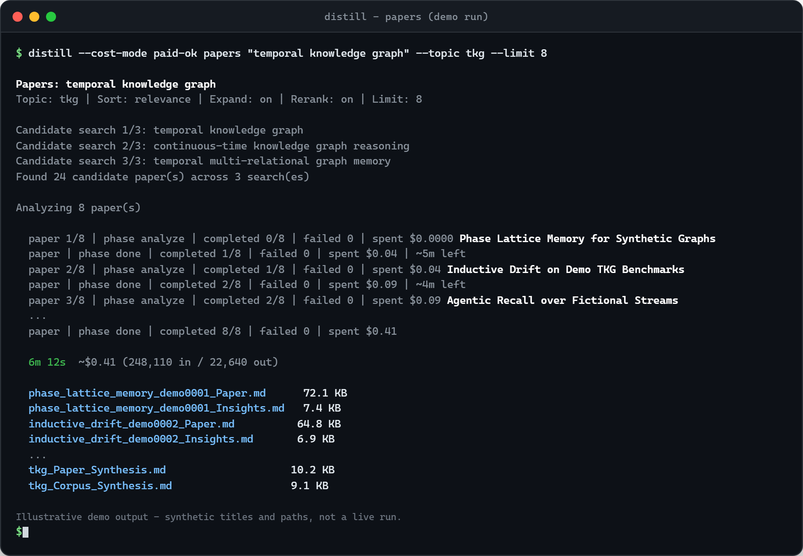

# Distill

[](https://github.com/blisspixel/distillr/actions/workflows/ci.yml)
[](https://pypi.org/project/distillr/)
[](https://pypi.org/project/distillr/)
[](LICENSE)
[](https://www.python.org/downloads/)

> Point Distill at a research goal. It finds papers, talks, and pages from
> operator-trusted sites, captures supplied repos, podcasts, feeds, posts, and
> local files, analyzes each into structured insights with source receipts,
> verifies claims before write, and synthesizes a plain-Markdown corpus on your
> disk. Browse it in Obsidian, query it over MCP, ask cited questions that can
> re-enter the corpus, and refresh on a cadence instead of going stale.

*PyPI package [`distillr`](https://pypi.org/project/distillr/); CLI is `distill`
(plus `distill-mcp`).*

## Install and first run

```bash
uv tool install distillr
distill --cost-mode no-metered init
distill --cost-mode no-metered papers "temporal knowledge graph" --topic tkg --limit 5 --preview
```

`no-metered` only allows routes Distill can prove are not API-billed. Preview
builds a current arXiv shortlist without ingesting. On a local Ollama or LM
Studio route that spend is `$0.00` and the budget is wall clock: a two-paper
ingest can take an hour on a laptop, and that is the control, not a hang. Run
`distill bench` once so preview can print how long the full ingest will take on
this machine. If local inference is up, use it to ingest more and stay more
current: ad hoc commands at the keyboard, `distill profile refresh --max-hours
6 --yes` after hours so many topics keep feeding the markdown wiki. When API
spend is OK, the same pipeline goes wide and fast. When the shortlist looks
right:

Hard dollar budgets cover registered token-priced calls. Gemini Deep Research
has no provider request-side dollar ceiling, so Distill refuses that agent
before remote setup whenever a hard workflow or MCP budget is active.

```bash
distill --cost-mode paid-ok papers "temporal knowledge graph" --topic tkg --limit 20
distill --cost-mode paid-ok papers "temporal knowledge graph" --topic tkg --limit 20 --workers 3
```

Paid-ok is how you do a lot quickly: preview the shortlist, then ingest a large
set in minutes instead of hours. Paper analysis stays one-at-a-time by default.
After reviewing the projected total, `--workers 2` or `--workers 3` analyzes
independent papers in a small bounded group. Discovery, artifact writes,
verification, synthesis, and report sections remain serialized.



*Illustrative demo (synthetic titles and paths). Real runs use current arXiv
results and your configured model route. Distill estimates the selected route
before spend; actual cost and duration depend on source size and model output.*

Alternate installers, keys, local models, and updates:
[`docs/install.md`](docs/install.md). Full command reference:
[`docs/usage.md`](docs/usage.md).

## What you get

One local `library/` of plain Markdown: no database, no cloud lock-in. Same
pipeline shape for every source (capture → analyze → verify → synthesize), with
a write-time verify gate.

| Source | Entry point |
|---|---|
| YouTube | `distill latest`, `distill video`, `distill discover` |
| Websites | `distill site`, `distill site-batch` |
| arXiv | `distill papers` |
| X, repos, podcasts, newsletters, local files | `distill ingest <url-or-path>` |

Plus `distill ask` (cited answers from the corpus), `distill audit` (free trust
report), and `distill report` (a corpus-first sequential report by default,
with explicit accordion and Deep Research profiles). MCP and recurring
profiles expose the same durable corpus to agents. Artifact layout and samples:
[`docs/outputs.md`](docs/outputs.md). Real example corpus:
[`examples/`](examples/README.md).

Agent distribution uses one canonical Agent Skill plus an
[Agent Plugins 1.0.0](https://agent-plugins.org/specification) portable package
and separate client compatibility surfaces. The specification is currently a
Working Draft. `distill export <topic> --format okf` produces an
[OKF v0.2](https://github.com/GoogleCloudPlatform/knowledge-catalog/blob/main/okf/SPEC.md)
projection with portable provenance, bounded receipt copies, lifecycle fields,
and digest-bound machine-verification events. The native `library/` remains the
source of truth. Exact standards boundaries and update policy:
[`docs/interoperability.md`](docs/interoperability.md).

How Distill differs from Deep Research tools, notebooks, and Markdown wikis:
[`docs/positioning.md`](docs/positioning.md).

## Docs

| Doc | For |
|---|---|
| [`docs/README.md`](docs/README.md) | Full documentation index |
| [`docs/usage.md`](docs/usage.md) | Commands, flags, first recipes |
| [`docs/install.md`](docs/install.md) | Install, providers, local models |
| [`docs/cost.md`](docs/cost.md) | Cost model and guardrails |
| [`docs/mcp.md`](docs/mcp.md) | MCP tools and agent paths |
| [`docs/outputs.md`](docs/outputs.md) | What every artifact contains |
| [`docs/architecture.md`](docs/architecture.md) | Data flow and routing |
| [`docs/invariants.md`](docs/invariants.md) | Design charter |
| [`docs/interoperability.md`](docs/interoperability.md) | Agent Plugins and OKF baselines |
| [`docs/SECURITY.md`](docs/SECURITY.md) | Trust boundaries and disclosure |
| [`docs/CONTRIBUTING.md`](docs/CONTRIBUTING.md) | Dev setup and quality gates |
| [`docs/CHANGELOG.md`](docs/CHANGELOG.md) | What shipped |
| [`ROADMAP.md`](ROADMAP.md) | What is next |

## Status

Active beta with a broad working surface: sources, discovery, verification,
synthesis, ask, audit, MCP, dashboard, profiles, and deferred workers. Every
change clears the same release gate: 95% branch coverage, Ruff, Pyright,
import-linter, Bandit, pip-audit, the supported Python matrix, and build
provenance. Covered v1 contract snapshots are freeze-ready under the published
compatibility policy. Pin versions if you integrate on MCP schemas or
frontmatter because uncovered pre-1.0 surfaces can still improve additively.

Version 1.0 is a future stability commitment, not a calendar date. Five paired
Linux and macOS runs now characterize public-runner variance and support an
advisory regression policy. The remaining gates include cross-platform install,
cold-start, export, live-journey, accessibility, and freeze-time security
evidence. See the [`roadmap`](ROADMAP.md#100---stability-commitment--quality-bar)
and [`comparable performance history`](docs/performance/comparable-history-0.19.70.md).

## License

Apache 2.0. See [`LICENSE`](LICENSE).
