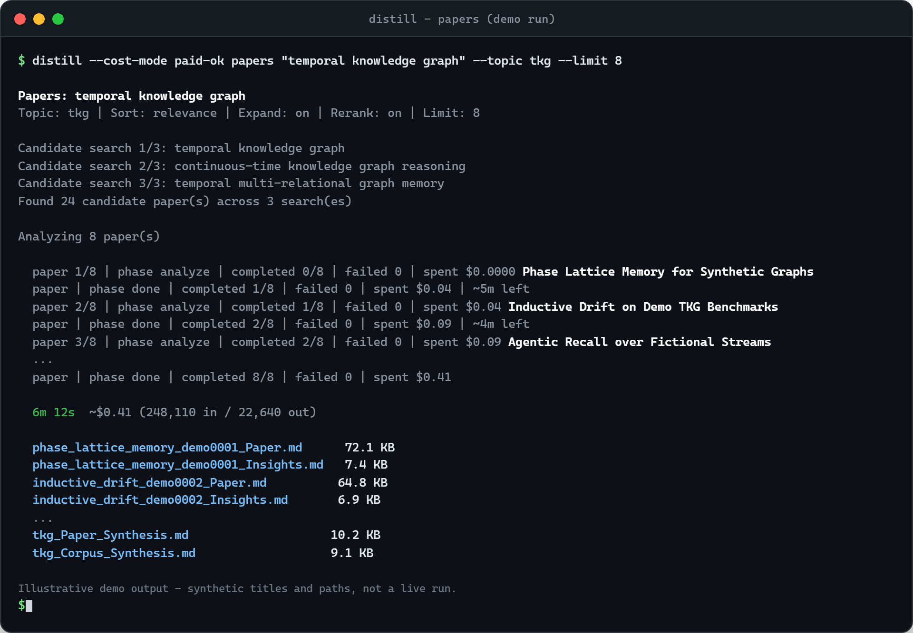

# Distill

[](https://github.com/blisspixel/distillr/actions/workflows/ci.yml)
[](https://pypi.org/project/distillr/)
[](https://pypi.org/project/distillr/)
[](LICENSE)
[](https://www.python.org/downloads/)

> Distill turns a research goal into dependable understanding backed by a
> persistent, verifiable body of evidence.
> It finds papers, talks, and pages from operator-trusted sites, captures
> supplied repos, podcasts, feeds, posts, and local files, analyzes them with
> source receipts, verifies claims before write, and synthesizes a local
> plain-Markdown corpus. Use it to understand a field, inspect the evidence,
> ask cited questions, and keep the research current across repeated runs.

*PyPI package [`distillr`](https://pypi.org/project/distillr/); CLI is `distill`
(plus `distill-mcp`).*

## Install and first run

```bash
uv tool install distillr
distill --cost-mode no-metered init
distill --cost-mode no-metered papers "temporal knowledge graph" --topic tkg --limit 5 --preview
```

`no-metered` refuses API-billed or unproved routes. Preview builds a current
arXiv shortlist without ingesting. Ollama requires a cloud-disabled daemon
and an installed local model; localhost alone is insufficient. Follow the
[local setup and upgrade steps](docs/install.md#local-models-ollama--lm-studio)
before inference. On a proven local Ollama or LM Studio route the direct API
spend is `$0.00` and the budget is wall clock: a two-paper
ingest can take an hour on a laptop, and that is the control, not a hang. Run
`distill bench` once so preview can print how long the full ingest will take on
this machine. Use local inference to revisit topics that matter to your
question: ad hoc commands at the keyboard, or `distill profile refresh
--max-hours 6 --yes` after hours for recurring profiles. Choose sources for
their distinct evidence and useful context. When API spend is OK, the same
pipeline can process a broader shortlist quickly. When the shortlist looks right:

```bash
distill --cost-mode paid-ok papers "temporal knowledge graph" --topic tkg --limit 20
distill --cost-mode paid-ok papers "temporal knowledge graph" --topic tkg --limit 20 --workers 3
```

Paid-ok shortens turnaround for a reviewed source set: preview for relevance,
distinct evidence, and useful context, then ingest the selected sources in
minutes instead of hours. Paper analysis stays one-at-a-time by default.
After reviewing the projected total, `--workers 2` or `--workers 3` analyzes
independent papers in a small bounded group. Discovery, artifact writes,
verification, synthesis, and report sections remain serialized.

Hard dollar budgets cover registered token-priced calls. Gemini Deep Research
has no provider request-side dollar ceiling, so Distill refuses that agent
before remote setup whenever a hard workflow or MCP budget is active.



*Illustrative demo (synthetic titles and paths). Real runs use current arXiv
results and your configured model route. Distill estimates the selected route
before spend; actual cost and duration depend on source size and model output.*

Alternate installers, keys, local models, and updates:
[`docs/install.md`](docs/install.md). Full command reference:
[`docs/usage.md`](docs/usage.md).

OpenRouter is available as an optional metered route when direct-provider quota
or local inference is not suitable. It requires an explicit concrete
`author/model` slug, requests Zero Data Retention routing by default, records
OpenRouter's reported billed cost, and remains blocked by `no-metered`. General
research commands never select it automatically. The opt-in editorial workflow
can use explicitly configured OpenRouter routes when local inference is
unavailable. See the [provider setup](docs/install.md#openrouter-optional-metered-route).

Current API candidates, prices, context limits, and SDK compatibility are
recorded in the [October 6 model audit](docs/research/api-models-2026-10-06.md).
Default routes stay pinned until research-quality evaluations justify a change.

## Write from a private perspective

`distill editorial` reads current publisher sources, develops and critiques
blog ideas, plans an argument, drafts, rewrites, reviews
the evidence and voice, and exports clean Markdown and DOCX. Keep the writer's
role, company, audience and style in a Git-ignored perspective file:

```bash
distill editorial init
distill editorial preview
distill editorial run
```

Set an installed local model in `private/perspective.toml`. To permit the named
OpenRouter routes, explicitly enable `budget.allow_metered`; the example has a
`$5` weekly and `$2` per-run ceiling. Persistent reservations prevent concurrent
runs or restarts from silently resetting spend. The paid first draft always
receives a non-Anthropic rewrite, followed by evidence and editorial checks.
Retonr's existing candidate checker is optional. Outputs remain private drafts
for review. See [editorial setup](docs/editorial.md) and the
[dated model comparison](docs/research/editorial-models-2026-09-09.md).

To use the process directly in an agent host, choose the optional
[standalone editorial skill](docs/portable-editorial-skill.md). It uses the
host's research, writing and document tools, with a private person or company
perspective. Distillr and Retonr are optional. Skill and plugin packages cover
Copilot, Claude, Cowork, Codex and the portable Agent Plugins format. A skill
alone cannot enforce a dollar cap; paid calls need an enforcing adapter.

## What you get

One local `library/` of plain Markdown: no database, no cloud lock-in. Same
pipeline shape for every source (capture → analyze → verify → synthesize), with
a write-time verify gate.

| Source | Entry point |
|---|---|
| YouTube | `distill latest`, `distill video`, `distill discover` |
| Websites | `distill site`, `distill site-batch` |
| arXiv | `distill papers` |
| X, repos, podcasts, newsletters, local files | `distill ingest <url-or-path>` |

Plus `distill ask` (cited answers from the corpus), `distill audit` (free trust
report), and `distill report` (a corpus-first sequential report by default,
with explicit accordion and Deep Research profiles). MCP and recurring
profiles expose the same durable corpus to agents. Artifact layout and samples:
[`docs/outputs.md`](docs/outputs.md). Real example corpus:
[`examples/`](examples/README.md).

The product direction is an exceptional research desk, not a larger pile of
files: better source curation, clearer disagreement and lineage, meaningful
change across refreshes, and guidance on what to read or investigate next. The
development doctrine and feature-admission test are in
[`docs/design/research-desk-doctrine.md`](docs/design/research-desk-doctrine.md).

Dependable understanding requires care for the evidence: keep sources and
their dates distinct from extraction and authored interpretation, preserve
qualifications and uncertainty, explain unresolved disagreement, and disclose
collection limits. Refresh should explain what changed and which conclusions
matter to the reader's question. Corrections and withdrawals should retain
appropriate provenance and flag affected synthesis so obsolete conclusions
are not presented as current. These are development requirements; selective
revision and correction handling remain planned work, with a
[two-source correction acceptance test](docs/design/research-desk-doctrine.md#correction-and-disagreement-episode).

Corpus agent distribution uses one canonical Agent Skill plus an
[Agent Plugins 1.0.0](https://agent-plugins.org/specification) portable package
and separate client compatibility surfaces. Version 1.0.0 is published.
`distill export <topic> --format okf` produces an
[OKF v0.2](https://github.com/GoogleCloudPlatform/knowledge-catalog/blob/main/okf/SPEC.md)
projection with portable provenance, bounded receipt copies, lifecycle fields,
and digest-bound machine-verification events. The native `library/` remains the
source of truth. Exact standards boundaries and update policy:
[`docs/interoperability.md`](docs/interoperability.md).

How Distill differs from Deep Research tools, notebooks, and Markdown wikis:
[`docs/positioning.md`](docs/positioning.md).

## Docs

| Doc | For |
|---|---|
| [`docs/README.md`](docs/README.md) | Full documentation index |
| [`docs/usage.md`](docs/usage.md) | Commands, flags, first recipes |
| [`docs/install.md`](docs/install.md) | Install, providers, local models |
| [`docs/cost.md`](docs/cost.md) | Cost model and guardrails |
| [`docs/mcp.md`](docs/mcp.md) | MCP tools and agent paths |
| [`docs/outputs.md`](docs/outputs.md) | What every artifact contains |
| [`docs/architecture.md`](docs/architecture.md) | Data flow and routing |
| [`docs/invariants.md`](docs/invariants.md) | Design charter |
| [`docs/design/research-desk-doctrine.md`](docs/design/research-desk-doctrine.md) | Product doctrine and feature rubric |
| [`docs/interoperability.md`](docs/interoperability.md) | Agent Plugins and OKF baselines |
| [`docs/SECURITY.md`](docs/SECURITY.md) | Trust boundaries and disclosure |
| [`docs/CONTRIBUTING.md`](docs/CONTRIBUTING.md) | Dev setup and quality gates |
| [`docs/CHANGELOG.md`](docs/CHANGELOG.md) | What shipped |
| [`ROADMAP.md`](ROADMAP.md) | Versioned next steps and 1.0 exit gates |

## Status

Active beta with a broad working surface: sources, discovery, verification,
synthesis, ask, audit, MCP, dashboard, profiles, and deferred workers. Every
change clears the same release gate: 95% branch coverage, Ruff, Pyright,
import-linter, Bandit, pip-audit, the supported Python matrix, and build
provenance. Covered v1 contract snapshots are freeze-ready under the published
compatibility policy. Pin versions if you integrate on MCP schemas or
frontmatter because uncovered pre-1.0 surfaces can still improve additively.

Version 1.0 is a future stability commitment, not a calendar date. Five paired
Linux and macOS runs now characterize public-runner variance and support an
advisory regression policy. The remaining gates include cross-platform install,
cold-start, export, live-journey, accessibility, and freeze-time security
evidence. See the [`roadmap`](ROADMAP.md#100---stability-commitment--quality-bar)
and [`comparable performance history`](docs/performance/comparable-history-0.19.70.md).

## License

Apache 2.0. See [`LICENSE`](LICENSE).
